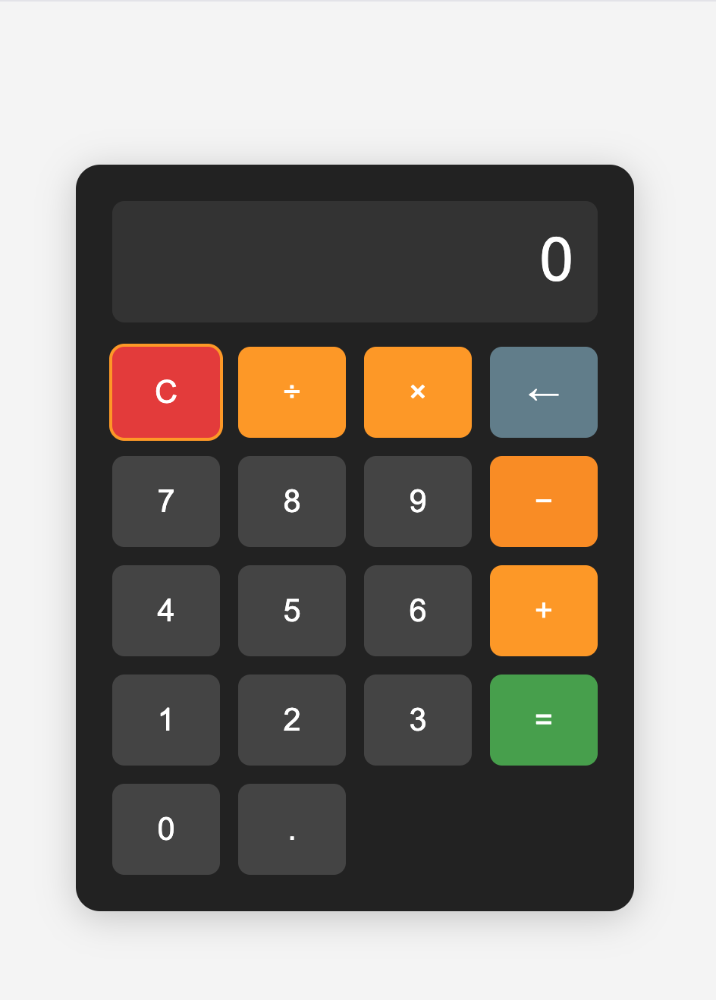

# demo picture

# Calculator App

A simple, responsive calculator web app built with HTML, CSS, and JavaScript.

## Features

- Basic arithmetic: addition, subtraction, multiplication, division
- Decimal support
- Chained operations
- Division by zero error handling
- Backspace and clear buttons
- Keyboard support
- Responsive, accessible design

## How to Use

1. **Open `index.html` in your browser.**
2. **Enter numbers** by clicking the digit buttons (0–9) or typing on your keyboard.
3. **Choose an operator** (+, −, ×, ÷) to perform calculations.
4. **Use the decimal (.)** for floating-point numbers.
5. **Press =** to see the result.
6. **Press C** to clear/reset the calculator.
7. **Use ← (backspace)** to delete the last digit.
8. **Keyboard shortcuts:**
   - Digits: 0–9
   - Operators: +, -, \*, /
   - Decimal: .
   - Equals: = or Enter
   - Clear: C or c
   - Backspace: Backspace key

## Example Calculations

- `5 + 3 = 8`
- `10 ÷ 2 × 3 = 15`
- `7.5 + 2.3 = 9.8`
- `0 ÷ 0 = Error`

## Deployment

You can deploy this app as a static site on GitHub Pages, Netlify, Vercel, or any web server.

## Accessibility

- All buttons are focusable and usable with Tab.
- Works with both mouse and keyboard input.

## File Structure

- `index.html` — Calculator page structure
- `styles.css` — Visual design and layout
- `script.js` — Calculator logic and interactivity

---

Feel free to customize or extend the app with more features!
